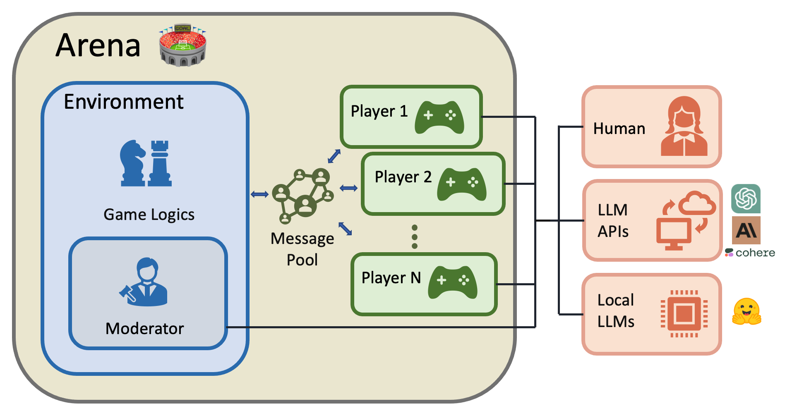

<!--
  Title: Chat Arena
  Description: Chat Arena (or ChatArena) is a language game environment for Large Language Models (LLMs) like GPT-3, GPT-4, ChatGPT, etc.
  Author: Yuxiang Wu
  -->

<h1 align="center"> 🏟 <span style="color:orange">ChatArena</span> </h1>

<h3 align="center">
    <p>Multi-Agent Language Game Environments for LLMs</p>
</h3>


[](https://github.com/chatarena/chatarena/blob/main/LICENSE)
[](https://pypi.org/project/chatarena/)
[](https://www.python.org/downloads/release/python-370/)
[](https://twitter.com/_chatarena)
[](https://join.slack.com/t/chatarena/shared_invite/zt-1t5fpbiep-CbKucEHdJ5YeDLEpKWxDOg)

---

ChatArena is a Python library designed to facilitate communication and collaboration between multiple Large Language
Models (LLMs).
It provides the following features:

- **Language Game Environments**: it provides a framework for creating multi-agent language game environments and a set
  of general-purposed language-driven environments.
- **Infrastructure for Multi-LLM Interaction**: it allows you to quickly create multiple LLM-powered player agents and
  enables seamless communication between them.
- **User-friendly Interfaces**: it provides both Web browser UI and command line interface (CLI) to develop (prompt
  engineer) your LLM players to succeed in the environment.



## Getting Started

**Try our online demo:**
[](https://chatarena-chatarena-demo.hf.space)
[](https://vimeo.com/816979419)

### Installation

Requirements:

- Python >= 3. 7
- OpenAI API key (optional, for using GPT-3.5-turbo or GPT-4 as an LLM agent)

Install with pip:

```bash
pip install chatarena
```

or install from source:

```bash
pip install git+https://github.com/chatarena/chatarena
```

To use GPT-3 as an LLM agent, set your OpenAI API key:

```bash
export OPENAI_API_KEY="your_api_key_here"
```

### Launch the Demo Locally

The quickest way to see ChatArena in action is via the demo Web UI.
To launch the demo on your local machine, you first need to git clone the repository and install it from source
(see above instruction). Then run the following command in the root directory of the repository:

```shell
gradio app.py
```

This will launch a demo server for ChatArena, and you can access it from your browser.

[//]: # (The interface looks like this:)

[//]: # (![webui screenshot]&#40;docs/images/webui.png&#41;)

Check out this video to learn how to use Web
UI: [](https://vimeo.com/816979419)

## Basic Usage

### Key Concepts

- **Player**: a player is an agent that can interact with other players in a game environment. A player is defined by
  its name, its backend, and its role description.
    - **Backend**: a backend is a class that actually processes queries and generates responses in a conversation. A
      backend can be a human, a remote or local LLM, or any program you create.
- **Environment**: an environment is a class that defines the rules of a game and the game state transition.
    - **Moderator**: a moderator is a special type of player that can control the game environment. It allows you to
      define game environments using an LLM.
- **Arena**: an arena is a utility class that contains the game environment and the players. It enables you to easily
  run the game and save the game history, and interact with the game via the Web UI or CLI.

### Step 1: Define Multiple Players with LLM Backend

```python
from chatarena.agent import Player
from chatarena.backends import OpenAIChat

# Describe the environment (which is shared by all players)
environment_description = "It is in a university classroom ..."

# A "Professor" player
player1 = Player(name="Professor", backend=OpenAIChat(),
                 role_desc="You are a professor in ...",
                 global_prompt=environment_description)
# A "Student" player
player2 = Player(name="Student", backend=OpenAIChat(),
                 role_desc="You are a student who is interested in ...",
                 global_prompt=environment_description)
# A "Teaching Assistant" player
player3 = Player(name="Teaching assistant", backend=OpenAIChat(),
                 role_desc="You are a teaching assistant of the module ...",
                 global_prompt=environment_description)
```

### Step 2: Create a Language Game Environment

You can also create a language model-driven environment and add it to the ChatArena:

```python
from chatarena.environments.conversation import Conversation

env = Conversation(player_names=[p.name for p in [player1, player2, player3]])
```

### Step 3: Run the Language Game using Arena

`Arena` is a utility class to help you run language games.

```python
from chatarena.arena import Arena

arena = Arena(players=[player1, player2, player3],
              environment=env, global_prompt=environment_description)
# Run the game for 10 steps
arena.run(num_steps=10)

# Alternatively, you can run your own main loop
for _ in range(10):
    arena.step()
    # Your code goes here ...
```

You can easily save your game play history to file

```python
arena.save_history(path=...)
```

and save your game config to file

```python
arena.save_config(path=...)
```

### Other Utilities

Load Arena from config file (here we use `examples/nlp-classroom-3players.json` in this repository as an example)

```python
arena = Arena.from_config("examples/nlp-classroom-3players.json")
arena.run(num_steps=10)
```

Run the game in an interactive CLI interface

```python
arena.launch_cli()
```

Check out this video to learn how to use
CLI: [](https://vimeo.com/816989884)

## Advanced Usage

### `ModeratedConversation`: a LLM-driven Environment

We support a more advanced environment called `ModeratedConversation` that allows you to **control the game dynamics
using an LLM**.
The moderator is a special player that controls the game state transition and determines when the game ends.
For example, you can define a moderator that track the board status of a board game, and end the game when a player
wins.
You can try out our Tic-tac-toe and Rock-paper-scissors games to get a sense of how it works:

```python
# Tic-tac-toe example
Arena.from_config("examples/tic-tac-toe.json").launch_cli()

# Rock-paper-scissors example
Arena.from_config("examples/rock-paper-scissors.json").launch_cli()
```

### Creating your Custom Environment

You can define your own environment by extending the `Environment` class. Here are the general steps:

1. Define the class by inheriting from a base class and setting `type_name`, then add the class
   to [`ALL_ENVIRONMENTS`](chatarena/environments/__init__.py#L17)
2. Initialize the class by defining `__init__` method (its arguments will define the corresponding config) and
   initializing class attributes
3. Implement game mechanics in methods `step`
4. Handle game states and rewards by implementing methods such as `reset`, `get_observation`, `is_terminal`,
   and `get_rewards`
5. Develop role description prompts (and global prompt if necessary) for players using CLI or Web UI and save them to a
   config file.

We provide [a detailed tutorial](docs/tutorials/create_your_environment.md) to demonstrate how to define a custom
environment,
using the [`Chameleon` environment](chatarena/environments/chameleon.py) as example.

If you want to port an existing library's environment to ChatArena, check
out [`PettingzooChess` environment](chatarena/environments/pettingzoo_chess.py) as an example.

## List of Games and Environments

### [Conversation](chatarena/environments/conversation.py)

A multi-player language game environment that simulates a
conversation.

* [NLP Classroom](examples/nlp-classroom-3players.json): a 3-player language game environment that simulates a
  classroom
  setting. The game is played in turns, and each turn a player can either ask a question or answer a question.
  The game ends when all players have asked and answered all questions.

### [Moderator Conversation](chatarena/environments/conversation.py)

Based on converstion, but with a moderator that controls the game dynamics.

* [Rock-paper-scissors](examples/rock-paper-scissors.json): a 2-player language game environment that simulates a
  rock-paper-scissors game with moderator conversation.
  Both player will act in parallel, and the game ends when one player wins 2 rounds.
* [Tic-tac-toe](examples/tic-tac-toe.json): a 2-player language game environment that simulates a tic-tac-toe
  game with moderator conversation.
  The game is played in turns, and each turn a player can either ask for a move or make a move. The game ends when
  one
  player wins or the board is full.

### [Chameleon](chatarena/environments/chameleon.py)

A multi-player social deduction game. There are two roles in the game, chameleon and non-chameleon.
The topic of the secret word will be first revealed to all the players.
Then the secret word will be revealed to non-chameleons.
The chameleon does not know the secret word.
The objective in the game depends on the role of the player:

- If you are not a chameleon, your goal is to reveal the chameleon without exposing the secret word.
- If you are a chameleon, your aim is to blend in with other players, avoid being caught, and figure out the secret
  word.
  There are three stages in the game:

1. The giving clues stage: each player will describe the clues about the secret word.
2. The accusation stage: In this stage, each player will vote for another player who is most likely the chameleon. The
   chameleon should vote for other players.
3. The guess stage: If the accusation is correct, the chameleon should guess the secret word given the clues revealed by
   other players.

### [PettingZooChess](chatarena/environments/pettingzoo_chess.py)

A two-player chess game environment that uses the PettingZoo Chess environment.

## Contributing

We welcome contributions to improve and extend ChatArena. Please follow these steps to contribute:

1. Fork the repository.
2. Create a new branch for your feature or bugfix.
3. Commit your changes to the new branch.
4. Create a pull request describing your changes.
5. We will review your pull request and provide feedback or merge your changes.

Please ensure your code follows the existing style and structure.

## Citation

If you find ChatArena useful for your research, please cite our repository (our arxiv paper is coming soon):

```bibtex
@misc{ChatArena,
  author = {Yuxiang Wu, Zhengyao Jiang, Akbir Khan, Yao Fu, Laura Ruis, Edward Grefenstette, and Tim Rocktäschel},
  title = {ChatArena: Multi-Agent Language Game Environments for Large Language Models},
  year = {2023},
  publisher = {GitHub},
  journal = {GitHub repository},
  howpublished = {\url{https://github.com/chatarena/chatarena}},
}
```

## Contact

If you have any questions or suggestions, feel free to open an issue or submit a pull request.
You can also follow us on [Twitter](https://twitter.com/_chatarena) or
join [our Slack channel](https://join.slack.com/t/chatarena/shared_invite/zt-1t5fpbiep-CbKucEHdJ5YeDLEpKWxDOg)
to get the latest updates.

Happy chatting!


