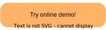

<h1 align="center"> 🏟 <span style="color:orange">Chat Arena</span> </h1>

<h3 align="center">
    <p>Multi-Agent Language Game Environments for LLMs</p>
</h3>


[](https://github.com/chatarena/chatarena/blob/main/LICENSE) [](https://pypi.org/project/chatarena/) [](https://www.python.org/downloads/release/python-370/) [](https://twitter.com/_chatarena)
---

Chat Arena is a Python library designed to facilitate communication and collaboration between multiple large language
models (LLMs).
It provides the following features:

- **Language Game Environments**: it provides a framework for creating multi-agent language game environments, and a set
  of general-purposed language-driven environments.
- **Infrastructure for Multi-LLM Interaction**: it allows you to quickly create multiple LLM-powered player agents, and
  enables seamlessly communication between them.
- **User-friendly Interfaces**: it provides both Web browser UI and command line interface (CLI) to develop (prompt
  engineer) your LLM players to succeed in the environment.


## Getting Started

[](https://chatarena-chatarena-demo.hf.space)

### Installation

Requirements:

- Python >= 3. 7
- OpenAI API key (optional, for using GPT-3.5-turbo or GPT-4 as an LLM agent)

Install with pip:

```bash
pip install chatarena
```

or install from source:

```bash
git clone https://github.com/chatarena/chatarena
cd chatarena
pip install .
```

To use GPT-3 as an LLM agent, set your OpenAI API key:

```bash
export OPENAI_API_KEY="your_api_key_here"
```

### Launch the Demo Locally

The quickest way to see Chat Arena in action is via the demo Web UI.
To launch the demo on your local machine, you first need to git clone the repository and install it from source
(see above instruction). Then run the following command in the root directory of the repository:

```shell
gradio app.py
```

This will launch a demo server for Chat Arena and you can access it via http://127.0.0.1:7861/ in your browser.

[//]: # (TODO: put a gif here)

## Basic Usage

### Key Concepts

- **Player**: a player is an agent that can interact with other players in a game environment. A player can be a human
  or
  a large language model (LLM). A player is defined by its name, its backend, and its role.
    - **Backend**: a backend is a Python class that defines how a player interacts with other players. A backend can be
      a
      human, a LLM, or a combination of them. A backend is defined by its name, its type, and its parameters.
- **Environment**: an environment is a Python class that defines the rules of a game. An environment is defined by its
  name, its type, and its parameters.
    - **Moderator**: a moderator is a Python class that defines how the game is played. A moderator is defined by its
      name,
      its type, and its parameters.
- **Arena**: an arena is a Python class that defines the overall game. An arena is defined by its name, its type, and
  its
  parameters.

### Step 1: Define Multiple Players with LLM Backend

```python
from chatarena.agent import Player
from chatarena.backends import OpenAIChat

# Describe the environment (which is shared by all players)
environment_description = "It is in a university classroom ..."

# A "Professor" player
player1 = Player(name="Professor", backend=OpenAIChat(),
                 role_desc="You are a professor in ...",
                 global_prompt=environment_description)
# A "Student" player
player2 = Player(name="Student", backend=OpenAIChat(),
                 role_desc="You are a student who is interested in ...",
                 global_prompt=environment_description)
# A "Teaching Assistant" player
player3 = Player(name="Teaching assistant", backend=OpenAIChat(),
                 role_desc="You are a teaching assistant of module ...",
                 global_prompt=environment_description)
```

### Step 2: Create a Language Game Environment

You can also create a language model-driven environment and add it to the Chat Arena:

```python
from chatarena.environments.conversation import Conversation

env = Conversation(player_names=[p.name for p in [player1, player2, player3]])
```

### Step 3: Run the Language Game using Arena

Arena is a utility class to help you run language games.

```python
from chatarena.arena import Arena

arena = Arena(players=[player1, player2, player3],
              environment=env, global_prompt=environment_description)
# Run the game for 10 steps
arena.run(num_steps=10)

# Alternatively, you can run your own main loop
for _ in range(10):
    arena.step()
    # Your code goes here ...
```

You can easily save your game play history to file

```python
arena.save_history(path=...)
```

and save your game config to file

```python
arena.save_config(path=...)
```

### Other Utilities

Load Arena from config file (here we use `examples/nlp-classroom-3players.json` in this repository as an example)

```python
arena = Arena.from_config("examples/nlp-classroom-3players.json")
arena.run(num_steps=10)
```

Run the game in an interactive CLI interface

```python
arena.launch_cli()
```

[//]: # (TODO: put a CLI gif here)

## Advanced Usage

### `ModeratedConversation`: a LLM-driven Environment

We support a more advanced environment called `ModeratedConversation` that allows you to **control the game dynamics
using an LLM**.
The moderator is a special player that controls the game state transition and determines when the game ends.
For example, you can define a moderator that track the board status of a board game, and end the game when a player
wins.
You can try out our Tic-tac-toe and Rock-paper-scissors games to get a sense of how it works:

```python
# Tic-tac-toe example
Arena.from_config("examples/tic-tac-toe.json").launch_cli()

# Rock-paper-scissors example
Arena.from_config("examples/rock-paper-scissors.json").launch_cli()
```

### Creating your Custom Environment

You can define your own environment by extending the `Environment` class.
We provide [a tutorial](docs/tutorials/create_your_environment.md) to demonstrate how to define a custom environment,
using our `Chameleon` environment as example.

## Contributing

We welcome contributions to improve and extend Chat Arena. Please follow these steps to contribute:

1. Fork the repository.
2. Create a new branch for your feature or bugfix.
3. Commit your changes to the new branch.
4. Create a pull request describing your changes.
5. We will review your pull request and provide feedback or merge your changes.

Please ensure your code follows the existing style and structure.

## Contact

If you have any questions or suggestions, feel free to open an issue or submit a pull request.
You can also follow the lead
developer [](https://twitter.com/mindjimmy) to
get the latest updates.

Happy chatting!


